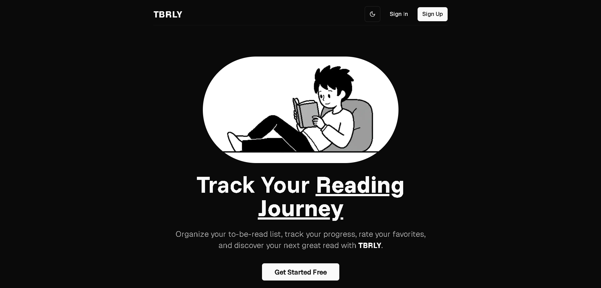

# 📚 TBRly

A sleek app to track your TBR (To Be Read) list, built with Next.js, Clerk auth, shadcn/ui, Neon Postgres, and Drizzle ORM.

## Screenshots



## Tech Stack

- **Next.js 14** - React framework
- **Clerk** - Authentication
- **shadcn/ui** - UI components
- **Tailwind CSS** - Styling
- **Neon Postgres** - Database
- **Drizzle ORM** - Database queries

## TODO

- [x] Set up Clerk authentication
- [x] Integrate shadcn/ui components
- [x] Connect to Neon Postgres with Drizzle ORM
- [x] Sync Clerk user data to the database
- [x] Customize Clerk Sign In UI with shadcn/ui styling
- [x] Update header UI (layout, navigation, responsiveness)
- [x] Add dark mode support using shadcn/ui theme system
- [x] Create landing page
  - [x] Hero section (headline, subtext, call-to-action)
  - [x] Feature highlights section
  - [x] Final call-to-action (sign up or start reading)
- [x] Add edit functionality, search filters, and genre tags
- [ ] Implement TBR list CRUD features
- [ ] Add user dashboard and book details pages
- [ ] Write basic tests and CI setup

## Getting Started

1. **Clone and install**

   ```bash
   git clone https://github.com/yourusername/tbrly.git
   cd tbrly
   npm install
   ```

2. **Set up environment variables**

   ```bash
   cp .env.example .env.local
   ```

3. **Run the development server**

   ```bash
   npm run dev
   ```

4. **Open [http://localhost:3000](http://localhost:3000)**

## Deploy on Vercel

The easiest way to deploy your Next.js app is to use the [Vercel Platform](https://vercel.com/new?utm_medium=default-template&filter=next.js&utm_source=create-next-app&utm_campaign=create-next-app-readme).

Check out the [Next.js deployment documentation](https://nextjs.org/docs/app/building-your-application/deploying) for more details.
